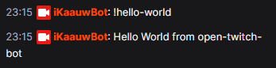

# open-twitch-bot
Bot pour le chat Twitch utilisé sur ma chaine https://www.twitch.tv/Kaauw

## Usage

### Remplir les informations d'identifications

#### cred.yaml
```yaml
---
identity: 
  username: Username
  password: oauth:token
channels:
  - Chaine 1
  - Chaine 2
  - Chaine XX
```

### Lancer le bot

```powershell
PS D:\dev\open-twitch-bot> node bot.js
* Connected to irc-ws.chat.twitch.tv:443
```

Sur le chat, tapez la commande "!hello-world"


